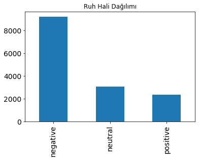
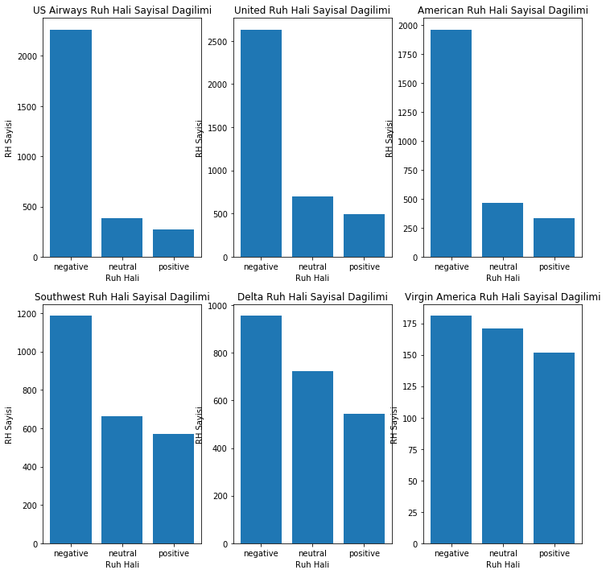
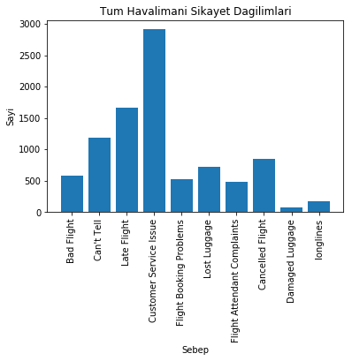
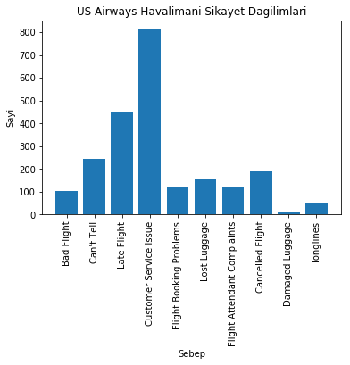
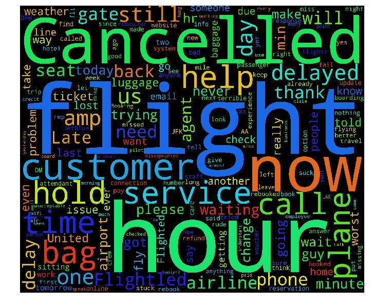

```python
import sklearn, pandas, numpy, urllib, zipfile
from sklearn.cross_validation import train_test_split
import matplotlib.pyplot as plt
%matplotlib inline
```

    /media/fool/LinuxStorage/pyharvester/env/lib/python3.5/site-packages/sklearn/cross_validation.py:44: DeprecationWarning: This module was deprecated in version 0.18 in favor of the model_selection module into which all the refactored classes and functions are moved. Also note that the interface of the new CV iterators are different from that of this module. This module will be removed in 0.20.
      "This module will be removed in 0.20.", DeprecationWarning)


```python
tweets = pandas.read_csv('Tweets.csv')
tweets.tail()
```


<div>
<table border="1" class="dataframe">
  <thead>
    <tr style="text-align: right;">
      <th></th>
      <th>tweet_id</th>
      <th>airline_sentiment</th>
      <th>airline_sentiment_confidence</th>
      <th>negativereason</th>
      <th>negativereason_confidence</th>
      <th>airline</th>
      <th>airline_sentiment_gold</th>
      <th>name</th>
      <th>negativereason_gold</th>
      <th>retweet_count</th>
      <th>text</th>
      <th>tweet_coord</th>
      <th>tweet_created</th>
      <th>tweet_location</th>
      <th>user_timezone</th>
    </tr>
  </thead>
  <tbody>
    <tr>
      <th>14635</th>
      <td>569587686496825344</td>
      <td>positive</td>
      <td>0.3487</td>
      <td>NaN</td>
      <td>0.0000</td>
      <td>American</td>
      <td>NaN</td>
      <td>KristenReenders</td>
      <td>NaN</td>
      <td>0</td>
      <td>@AmericanAir thank you we got on a different f...</td>
      <td>NaN</td>
      <td>2015-02-22 12:01:01 -0800</td>
      <td>NaN</td>
      <td>NaN</td>
    </tr>
    <tr>
      <th>14636</th>
      <td>569587371693355008</td>
      <td>negative</td>
      <td>1.0000</td>
      <td>Customer Service Issue</td>
      <td>1.0000</td>
      <td>American</td>
      <td>NaN</td>
      <td>itsropes</td>
      <td>NaN</td>
      <td>0</td>
      <td>@AmericanAir leaving over 20 minutes Late Flig...</td>
      <td>NaN</td>
      <td>2015-02-22 11:59:46 -0800</td>
      <td>Texas</td>
      <td>NaN</td>
    </tr>
    <tr>
      <th>14637</th>
      <td>569587242672398336</td>
      <td>neutral</td>
      <td>1.0000</td>
      <td>NaN</td>
      <td>NaN</td>
      <td>American</td>
      <td>NaN</td>
      <td>sanyabun</td>
      <td>NaN</td>
      <td>0</td>
      <td>@AmericanAir Please bring American Airlines to...</td>
      <td>NaN</td>
      <td>2015-02-22 11:59:15 -0800</td>
      <td>Nigeria,lagos</td>
      <td>NaN</td>
    </tr>
    <tr>
      <th>14638</th>
      <td>569587188687634433</td>
      <td>negative</td>
      <td>1.0000</td>
      <td>Customer Service Issue</td>
      <td>0.6659</td>
      <td>American</td>
      <td>NaN</td>
      <td>SraJackson</td>
      <td>NaN</td>
      <td>0</td>
      <td>@AmericanAir you have my money, you change my ...</td>
      <td>NaN</td>
      <td>2015-02-22 11:59:02 -0800</td>
      <td>New Jersey</td>
      <td>Eastern Time (US &amp; Canada)</td>
    </tr>
    <tr>
      <th>14639</th>
      <td>569587140490866689</td>
      <td>neutral</td>
      <td>0.6771</td>
      <td>NaN</td>
      <td>0.0000</td>
      <td>American</td>
      <td>NaN</td>
      <td>daviddtwu</td>
      <td>NaN</td>
      <td>0</td>
      <td>@AmericanAir we have 8 ppl so we need 2 know h...</td>
      <td>NaN</td>
      <td>2015-02-22 11:58:51 -0800</td>
      <td>dallas, TX</td>
      <td>NaN</td>
    </tr>
  </tbody>
</table>
</div>


```python
# Modelle alakası olmayan kolonları sildik
del tweets['tweet_coord']
del tweets['airline_sentiment_gold']
del tweets['negativereason_gold']
```


```python
tweets.airline_sentiment.value_counts().plot(kind='bar', title='Ruh Hali Dağılımı', fontsize=14)
```


    <matplotlib.axes._subplots.AxesSubplot at 0x7f50379a1470>





```python
def plot_sub_sentiment(havalimani):
    df=tweets[tweets['airline']==havalimani]
    count=df['airline_sentiment'].value_counts()
    Index = [1,2,3]
    plt.bar(Index, count)
    plt.xticks(Index,['negative','neutral','positive'])
    plt.ylabel('RH Sayisi')
    plt.xlabel('Ruh Hali')
    plt.title(havalimani+' Ruh Hali Sayisal Dagilimi')
    
plt.figure(1,figsize=(12, 12))
plt.subplot(231)
plot_sub_sentiment('US Airways')
plt.subplot(232)
plot_sub_sentiment('United')
plt.subplot(233)
plot_sub_sentiment('American')
plt.subplot(234)
plot_sub_sentiment('Southwest')
plt.subplot(235)
plot_sub_sentiment('Delta')
plt.subplot(236)
plot_sub_sentiment('Virgin America')
```





    Yukarıdaki çizimlerde ilk 3 havalimanı ile ilgili ruh halinin
    dağılımının negatif eğilimli, sonraki 3ünde ise daha dengeli 
    olduğu görülmekte.


```python
def olumsuz_sayisi(havalimani):
    
    if havalimani == 'Tum':
        df = tweets
    else:
        df = tweets[tweets['airline'] == havalimani]
    
    # Toplam olumsuz yorum sebeplerinin sayisini hesapladık    
    count = dict(df['negativereason'].value_counts())
    
    # Aynı değerleri eledik ve boş değerleri temizledik
    ozgun_degerler = list(tweets['negativereason'].unique())
    ozgun_degerler = [x for x in ozgun_degerler if str(x) != 'nan']
    
    # Temizlenen verilerle yeni bir tablo oluşturduk
    reasons_table = pandas.DataFrame({'Reasons':ozgun_degerler})
    
    # Olumsuz yorumlara sayilarini ekledik
    reasons_table['count'] = reasons_table['Reasons'].apply(lambda x: count[x])
    return reasons_table

def plot_reason(havalimani):
    """Girilen havalimanindaki olumsuz yorum sebeplerini ve sayilarini hesaplar
    ve çizer."""
    
    df = olumsuz_sayisi(havalimani)
    count = df['count']
    Index = range(1, (len(df)+1))
    plt.bar(Index,count)
    plt.xticks(Index,df['Reasons'],rotation=90)
    plt.ylabel('Sayi')
    plt.xlabel('Sebep')
    plt.title(havalimani + " Havalimani Sikayet Dagilimlari")
```


```python
plot_reason('Tum')
```





```python
plot_reason('US Airways')
```





```python
from wordcloud import WordCloud, STOPWORDS
```


```python
# Negatifleri tweetlerin oldugu sonuclari aldik.
df = tweets[tweets['airline_sentiment']=='negative']

# Tum tweetleri aralarinda ' ' karakteri olacak sekilde birlestirdik
words = ' '.join(df['text'])

# Link, retweet ve tag olmayan kelimeleri ayni sekilde birlestirdik.
cleaned_word = ' '.join([word for word in words.split()
                            if 'http' not in word
                                and not word.startswith('@')
                                and word != 'RT'
                            ])
```


```python
wordcloud = WordCloud(stopwords=STOPWORDS,
                      background_color='black',
                      width=3000,
                      height=2500
                     ).generate(cleaned_word)


plt.figure(1,figsize=(12, 12))
plt.imshow(wordcloud)
plt.axis('off')
plt.show()
```





    Görüldüğü üzere negetif tweetlerin çoğunda iptal edildi, uçuş
    saat kelimeleri geçmiş. Buradan kolaylıkla yolcuların gecikmeli
    veya iptal edilen uçuşlar ile ilgili yakındıklarını çıkarabiliriz
    
# Ön hazırlık ve Sınıflandırma

    Verilerin analizi burada bitiyor. Sonraki kısımda modelin 
    verileri daha iyi öğrenebilmesi için verileri hazırlayacağız. 


```python
import re
import nltk
from nltk.corpus import stopwords

# Kelimeleri indirmek icin 1 kereye mahsus calistirilmali
# nltk.download() 
```


```python
def tweet_to_words(raw_tweet):
    """
        Tweetteki anlamli kelimeleri cikartir.
    """
    # Sadece harf iceren karakter topluluklarini aldik
    letters_only = re.sub("[^a-zA-Z]", " ", raw_tweet) 
    
    # OLusan stringi kucuk harflere cevirip kelimelere ayirdik
    words = letters_only.lower().split()     
    
    # Ingilizcedeki and, the gibi kelimelerin veri olarak bir degeri yok
    # Gereksiz olan kelimeleri çıkarttık
    stops = set(stopwords.words("english"))                  
    meaningful_words = [w for w in words if not w in stops] 
    
    return( " ".join( meaningful_words )) 
```


```python
def clean_tweet_length(raw_tweet):
    """
        Anlamli kelimeleri cikartir ve uzunlugunu dondurur.
    """
    # Sadece harf iceren karakter topluluklarini aldik
    letters_only = re.sub("[^a-zA-Z]", " ",raw_tweet)    
    
    # OLusan stringi kucuk harflere cevirip kelimelere ayirdik 
    words = letters_only.lower().split()
    
    # Gereksiz olan kelimeleri çıkarttık
    stops = set(stopwords.words("english"))                  
    meaningful_words = [w for w in words if not w in stops] 
    
    return(len(meaningful_words)) 
```


```python
# Olumsuz tweetleri 0 digerlerini 1 olarak isaretledik
tweets['sentiment'] = tweets['airline_sentiment'].apply(lambda x: 0 if x=='negative' else 1)
```


```python
tweets['clean_tweet'] = tweets['text'].apply(lambda x: tweet_to_words(x))
```


```python
# Temizlenen tweetlerin uzunluklarini tabloya ekledik
tweets['Tweet_length'] = tweets['text'].apply(lambda x: clean_tweet_length(x))
```


```python
# Eldeki verileri egitim ve test verileri olarak ayirdik
train, test = train_test_split(tweets, test_size=0.2,random_state=42)
```


```python
# Egitim ve test verilerini yapayzeka modeline verebilmek
# icin listeye aktardik
train_clean_tweet=[]
for tweet in train['clean_tweet']:
    train_clean_tweet.append(tweet)
    
test_clean_tweet=[]
for tweet in test['clean_tweet']:
    test_clean_tweet.append(tweet)
```


```python
from sklearn.feature_extraction.text import CountVectorizer

# CountVectorizer listedeki kelimeleri numaralar ile ifade etmemizi sagliyor
v = CountVectorizer(analyzer = "word")
train_features= v.fit_transform(train_clean_tweet)
print(train_features[0])
test_features=v.transform(test_clean_tweet)
```

      (0, 3506)	1
      (0, 7604)	1
      (0, 8849)	1
      (0, 11008)	1
      (0, 7185)	1
      (0, 10884)	1


# Sınıflandırma

* LogisticRegression
* KNeighborsClassifier
* SVC
* DecisionTreeClassifier
* RandomForestClassifier
* AdaBoostClassifier
* GaussianNB

### Bazı Sınıflandırma Modellerinin Görselleri


                    


                    Logistic Regression
       
                    

                    
                    KNeighbors Classifier
                    


                    SVC (Support Vector Classifier)


                    
                    Decision Tree Classifier
                    


                    Random Forest Classifier

    
    Hazırladığımız verileri sklearnin gelişmiş yapısı sayesinde çaba
    sarfetmeden çeşitli sınıflandırma modellerinde kullanabiliriz.
    


```python
from sklearn.linear_model import LogisticRegression
from sklearn.neighbors import KNeighborsClassifier
from sklearn.svm import SVC, LinearSVC, NuSVC
from sklearn.tree import DecisionTreeClassifier
from sklearn.ensemble import RandomForestClassifier, AdaBoostClassifier, GradientBoostingClassifier
from sklearn.naive_bayes import GaussianNB
from sklearn.discriminant_analysis import LinearDiscriminantAnalysis
from sklearn.discriminant_analysis import QuadraticDiscriminantAnalysis
from sklearn.metrics import accuracy_score
```

    
    Aşağıda yapayzeka modellerini öğrenme oranı, tekrar sayısı gibi gerekli
    değerleriyle tanımladık.    


```python
Classifiers = [
    LogisticRegression(C=0.000000001, solver='liblinear', max_iter=200),
    KNeighborsClassifier(3),
    SVC(kernel="rbf", C=0.025, probability=True),
    DecisionTreeClassifier(),
    RandomForestClassifier(n_estimators=200),
    AdaBoostClassifier(),
    GaussianNB()]
```

    Ardından fit() metoduyla modelleri eğittik ve predict() metoduyla test
    verilerinide kullanarak doğruluk oranını ölçtük.


```python
# Kelimelerin sayisal ifadelerini diziye cevirdik
dense_features = train_features.toarray()
dense_test= test_features.toarray()

Accuracy=[]
Model=[]
for classifier in Classifiers:
    try:
        fit = classifier.fit(train_features,train['sentiment'])
        pred = fit.predict(test_features)
    except Exception:
        fit = classifier.fit(dense_features,train['sentiment'])
        pred = fit.predict(dense_test)
    accuracy = accuracy_score(pred,test['sentiment'])
    Accuracy.append(accuracy)
    Model.append(classifier.__class__.__name__)
    print(classifier.__class__.__name__+" dogruluk orani: "+str(accuracy))    
```

    LogisticRegression dogruluk orani: 0.645150273224
    KNeighborsClassifier dogruluk orani: 0.589139344262
    SVC dogruluk orani: 0.645150273224
    DecisionTreeClassifier dogruluk orani: 0.766051912568
    RandomForestClassifier dogruluk orani: 0.815573770492
    AdaBoostClassifier dogruluk orani: 0.785519125683
    GaussianNB dogruluk orani: 0.572404371585


    
    Artık eğittiğimiz modelin predict() metoduna tweetleri hazırlayıp vererek 
    negatif içerikli olup olmadığını tahmin ettirebiliriz.
    


```python
random_forest_classifier = Classifiers[4]
tahminler = random_forest_classifier.predict(test_features[:4])
```


```python
tahminler
```


    array([1, 0, 0, 1])


